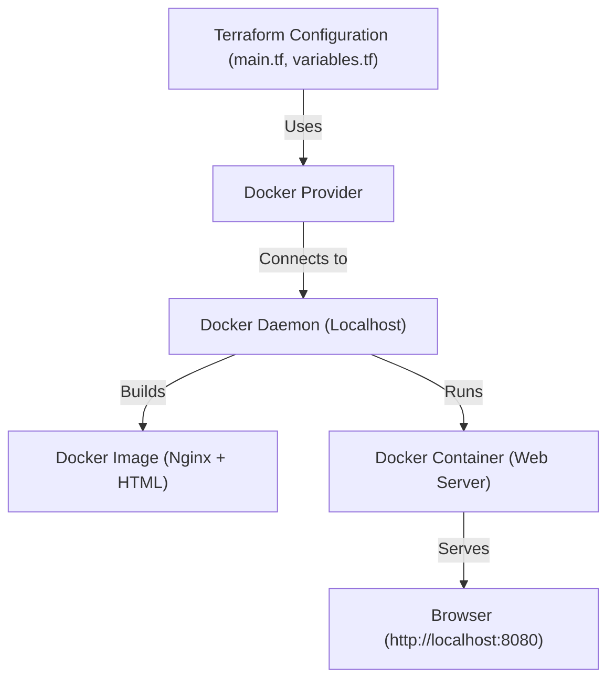

# Terraform Docker Provider — Single Tier Application Deployment

This project demonstrates how to automate the deployment of a **single-tier web application** using **Terraform’s Docker Provider**.
It provisions a lightweight web server (Nginx) container by defining Docker resources such as images, networks, and containers through **Infrastructure as Code (IaC)**.

---

## Overview

Terraform uses the **Docker Provider** to automate the following tasks:

* Build a Docker image from a simple Nginx-based Dockerfile.
* Deploy a running container exposing a web page on a specified port.
* Manage all Docker resources declaratively using Terraform configuration files.

---

## Architecture



---

## Project Structure

```
terraform-docker-single-tier/
│
├── main.tf             # Defines Docker image and container resources
├── variables.tf        # Declares configurable input variables
├── outputs.tf          # Displays outputs like container name and app URL
├── terraform.tfvars    # (Optional) User-defined variable values
└── app/
    ├── Dockerfile      # Builds a custom Nginx image
    └── index.html      # Simple web page served by Nginx
```

---

## Prerequisites

Ensure the following tools are installed:

* [Terraform](https://developer.hashicorp.com/terraform/downloads)
* [Docker](https://docs.docker.com/get-docker/)
* A working Docker environment (Docker Desktop or local daemon)

---

## Setup and Deployment

### Step 1: Initialize Terraform

```bash
terraform init
```

### Step 2: Validate the configuration

```bash
terraform validate
```

### Step 3: Preview the plan

```bash
terraform plan
```

### Step 4: Apply the configuration

```bash
terraform apply -auto-approve
```

Once the deployment is complete, open your browser and navigate to:

```
http://localhost:8080
```

You should see a web page served by the Nginx container.

---

## Outputs

After applying the configuration, Terraform displays:

* **Container Name** — The name of the created container.
* **App URL** — The local URL where the web app is running.

---

## Destroying Resources

To remove all created Docker resources:

```bash
terraform destroy -auto-approve
```

---

## Learning Objectives

* Understand Terraform’s **Docker Provider**.
* Practice defining Docker infrastructure using **Infrastructure as Code (IaC)**.
* Learn how to automate container build and deployment processes.

---

## Notes

If the container does not appear in Docker Desktop, ensure Terraform uses the correct Docker daemon socket by setting the provider’s `host` value in `main.tf`:

```hcl
provider "docker" {
  host = "unix:///var/run/docker.sock"
}
```